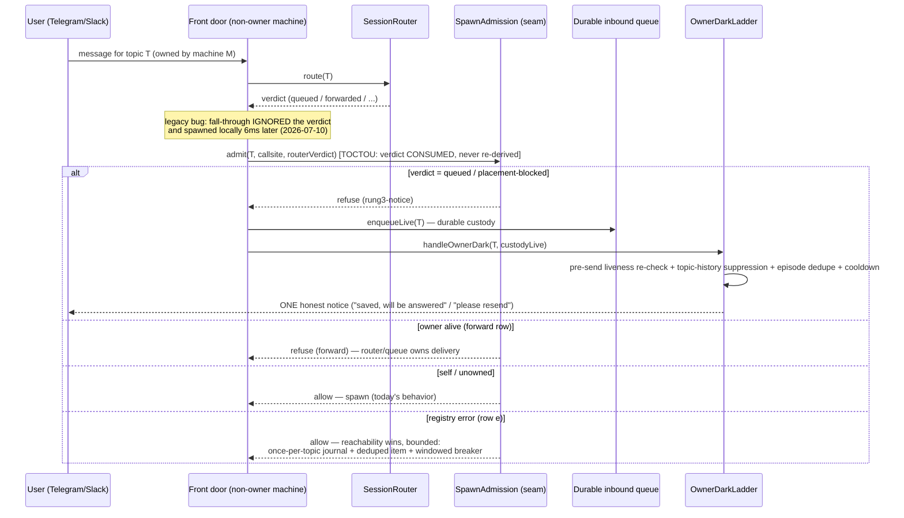
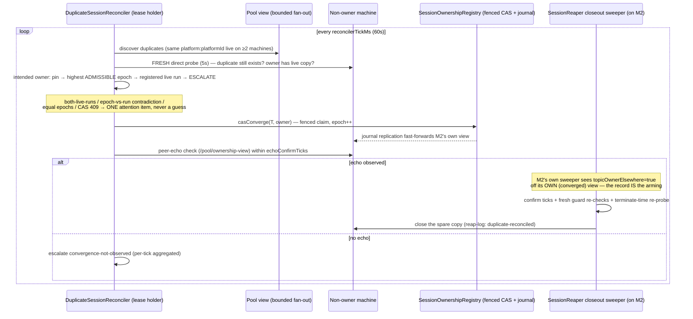

# Ownership-Gated Spawn — the three core flows (implementer map)

Companion to `docs/specs/ownership-gated-spawn-and-judgment-within-floors.md`
(§8 [core] deliverable). The glossary in §3 defines the terms; these diagrams
are the walk-through. All three flows are drawn at ENFORCE maturity — in
Increment 1 (dryRun) every refusal below is a journaled would-block and the
legacy path proceeds unchanged.

## Flow 1 — inbound message arrives at a NON-owner machine



## Flow 2 — duplicate detected → record converged → closeout closes the spare



## Flow 3 — commitment-shielded closeout (the §3.2.4a correction, Increment 2b)

```mermaid
sequenceDiagram
    participant SW as Closeout sweeper (closing machine)
    participant RG as ReapGuard
    participant OWN as Owner machine
    participant CT as CommitmentTracker (origin machine)

    SW->>RG: KEEP guards (fresh, at terminate time)
    Note over RG: open-commitment / recent-user-message KEEP —<br/>carve-out honored ONLY when BOTH hold:
    RG->>RG: (i) disposition-appropriate provenance fence in the LOCAL view<br/>(reconciler-minted convergence record, or the transfer-minted CAS record)
    RG->>OWN: (ii) terminate-time re-probe — owner copy LIVE and serving (5s)
    alt both hold
        SW->>SW: close the spare copy
        SW->>OWN: read origin's open topic-scoped commitments (authenticated mesh read)
        OWN->>OWN: mint successor via its own POST /commitments<br/>(externalKey custody:<topic>:<origin-id>, clamped+enveloped fields)
        OWN-->>CT: ACK (successor exists)
        CT->>CT: origin-side supersede verb — fenced to the VERIFIED successor —<br/>terminal `superseded-by-ownership-move` (own single-writer CAS)
    else fence or probe fails
        RG-->>SW: VETO (KEEP) — defer to next tick; custody moves ONLY after a confirmed close
    end
    Note over SW,CT: no ACK → origin records untouched + ONE custody-transfer-failed item.<br/>Flag dark/unavailable → open-commitment duplicates ESCALATE, never auto-close.
```
